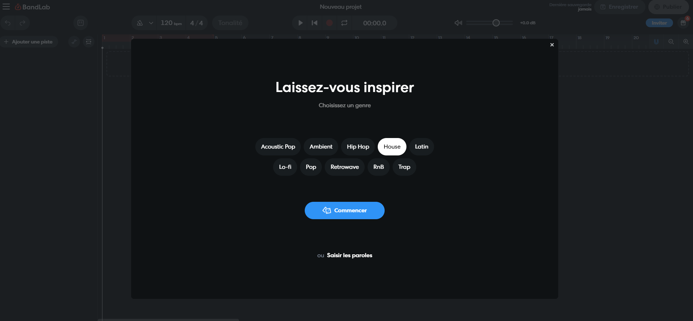

## Imagination de l'application Musicale

A l'origine, la ReacTable était une table servant à créer de la musique. 
Grâce aux différents objets, il était possible d'assembler des instruments, des sons et de les accorder entre eux pour créer sa propre musique. 
Voici une démonstration de la ReacTable, aujourd'hui indisponible dans le commerce. 

<video width="480" height="240" controls>
  <source src="video.mp4" type="video/mp4">
</video>

Nous avions pour objectif de créer une application musicale comme le proposait à l'origine la ReacTable. 
L'objectif de cette application était de permettre à l'utilisateur de créer sa musique tout en utilisant les différentes focntionnalités des tags. 

Pour cela, nous avons découper le travail en trois parties : 

    - Création de la musique
        - Trouver une musique à reproduire sur la table 
        - Découper cette musique en divers intruments
        - Enregistrer tous les instruments 
    
    - Création des fonctions Java 
        - Lecture de la musique 
        - Arrêt de la musique 
        - Augmentation et diminution du son 

    - Création d'animations 
        - Trouver des animations attrayantes pour l'utilisateur 
        - Réussir à les reproduire


## Création de l'application 

Maintenant que nous savions ce que nous voulions, nous n'avions plus qu'à le mettre en place. 
Nous avons ainsi commencer par la création d'une musique. 

### Création de la musique 

Afin de reproduire une musique, il fallait tout d'abordnous en approprier une. Pour cela, nous avons d'abord essayer de créer de nos mains notre morceau. Cependant, nous nous sommes vite rendu compte que cela allait nous prendre un certain temps pour un rendu peu concluant. 
Nous avons donc décider de procéder autrement. De nos jours, l'intelligence artificielle est capable de réaliser de grandes choses. 
Nous avons donc pris l'initiative d'essayer de créer une musique à l'aide de l'une d'elle. Après avoir parcouru de nombreux sites internet, nous sommes arrivés sur celui de Bandlab.com. Ce dernier nous proposait d'utiliser gratuitement une IA afin de créer un morceau d'un style choisi, et de pouvoir le modifier ainsi que de le télécharger. 



Suite à un essai, nous avons réussi à découper le sample en 4 instruments et à télécharger le son de chacun d'entre eux en format WAV. 

### Création des fonctions Java 

Une fois la musique téléchargée, nous devions l'implémenter dans le code. Pour cela, nous avons utilisé la bibliothèque "Minim". 
Cette dernière permet de créer différents lecteurs audio et possèdent des outils prédéfinis, utiles à la création de nos futurs fonctions. 
Le fonctionnement prévu de l'application est très simple. Lorsque qu'un tag est détecté, nous lions son identifiant à un lecteur, c'est à dire à un instrument, un son. Si l'utilisateur pose un tag sur la table, le lecteur raccordé se lance. Si l'utilisateur enlève ce tag, le son s'arrête. 

Importer la bibiliothèque :
```java
import ddf.minim.*;
import ddf.minim.effects.*;
```

Créer les lecteurs audio :
```java
AudioPlayer player1, player2, player3, player4;
```

Lier le tag au lecteur et lancer la musique s'il est détécter :
```java
  if (tobj.getSymbolID() == 4 && player4 == null) {
    player4 = minim.loadFile("part4-4.wav");
    player4.loop();
  }
```

Arrêter la musique :
```java
  if (tobj.getSymbolID() == 4 && player4 != null) {
    player4.close()
    player4 = null;
  }
```

Evidemment, ceci n'est qu'un exemple et un morceau du programme pour un lecteur. 
Les fonctions permettant la détection des tags, importé du FrameWork TUIO doivent être également présentes pour permettre le bon fonctionnement des autres fonctions. 

Nous voulions donc créer 4 lecteurs pour 4 sons différents et permettre à la personne de laisser parler sa créativité. 
Il n'avait donc plus qu'à trouver le bon rythme, et sa musique était créée. 

Cependant, nous avions pour objectif d'utiliser plus en profondeur les options offertes par les tags. 
Nous avons ainsi pensé à un effet de distortion du son afin qu'il augmente, ou qu'il diminue en fonction de la position de l'objet. 
La programmation d'une fonction Distortion était donc de mise. 
Pour cela, il fallait détécter si l'objet était posé sur la table ou non. Si c'était le cas, alors nous récupérions la position de l'objet ainsi que son identifiant. Cela permet de régler le son de chaque objet indépendemment des autres. Ensuite, nous n'avions plus qu'à appliquer une distortion du son en fonction de la position de l'objet. Et cela peut se faire de différentes manières, que ce soit de haut en bas, de gauche à droite ou en effectuant une rotation de l'objet sur lui même. 

Exemple de modification du son d'un instrument :
```java
  distortionAmount = map(tobj.getX() * width, 0, width, 0.0, 1.0);
  if (tobj.getSymbolID() == 4 && player4 != null) {
    player4.setGain(distortionAmount * 50 - 30);
  }
```

Encore une fois, cela a été possible grâce à la bibliothèque Minim mais également la fonction UpdateTuioObject qui permet de mettre à jour les coordonnées des tags en temps réel. 

### Création des animations

Afin de rendre le tout plus esthétique, nous avions pour objectif de créer des animations 2D qui s'adapte au mouvement des objets. 
Pour cela nous avons d'abord effectuer des recherches afin de comprendre comment cela pouvait marcher. 
Il ne s'agissiat en réalité que de formules mathématiques comprenant diverses variables que nous pouvions changer pour créer différentes formes auxquelles nous appliquions un fond de couleur. 
Après avoir trouvé une formule adéquate, nous avons essayé de la reproduire et de lier nos objets et plus précisemment leurs positions. Ainsi, en bougeant l'objet dans le sens souhaité, l'animation prend forme. 


Formule utilisée :
```java
return pow(pow(abs(cos(m * theta / 4.0) / a), n2) + 
            pow(abs(sin(m * theta / 4.0) / b), n3), -1.0 / n1);
```

En changeant les variables comme nous le souhaitons et en accordant la position de l'objet avec le dessin de l'animation
(Partie de la fonction DrawShape permettant la création de l'animation)
```java
  for (float theta = 0; theta <= TWO_PI; theta += 0.01) {
    float rad = r(theta, tobj.getX() * 5.0, tobj.getY() * 5.0, m, n1, n2, n3);
    float xx = rad * cos(theta) * 50;
    float yy = rad * sin(theta) * 50;
    vertex(xx, yy);
  }
```

Nous obtenions ceci : 

//insérer vidéo animation 

Enfin, l'assemblage de toutes ces fonctions ont permis ce rendu final : 

// insérer vidéo musique et animation