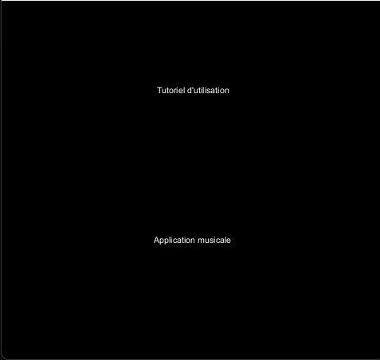

# Création d'un Menu 

Afin de séparer les deux applications et de permettre à l'utilisateur de choisir celle qu'il souhaite lancer, nous devions créer un menu. 

Nous avons pour cela, continué sur notre lancé et programmé en Java sous Processing.
Nous avons simplement afficher le nom des deux applications sur la table, une en haut et l'autre en bas. 

L'utilisateur n'a plus qu'à faire son choix. Il peut ainsi utiliser un objet et le déplacer en haut ou en bas pour valider son choix. 
Comme pour les autres applicaions, les coordonnées du tag, plus précisemment X et Y, sont récupérées et permettent l'éxecution d'une des deux applications en fonction des résulats obtenus. 

Nous avons également ajouté une option dans les deux applications, permettant à l'utilisateur de revenir au menu principal à tout moment. 
Il doit simplement déplacer un tag vers la partie inférieure droite de l'écran, vers l'icône correspondante. 

Pour ce faire, nous avons simplement délimiter une zone en bas de l'écran à l'aide des coordonnées. Si un tag franchit cette zone et dépasse les coordonnées nécessaires, alors l'application se ferme et laisse place au menu. 

