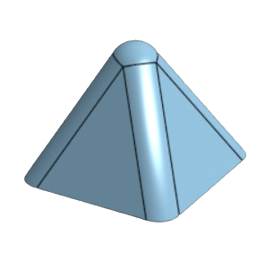
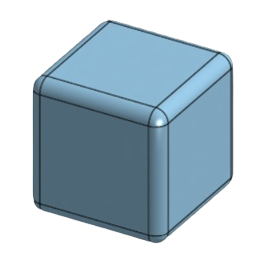

# Création d'objets

Pour utiliser un maximum les fonctionnalités de la table, nous avions besoin de plus d'objets pour accueillir les tags de détection. Ils devaient selon nous répondre à certaines contraintes:

- ne pas être trop grand pour éviter de prendre un espace trop important lorsqu'on les place sur l'écran,
- être agréable en main pour le confort de l'utilisateur,
- être facile à déplacer.

Nous avons donc réfléchi à plusieurs formes simples que l'on a ensuite modélisé pour les imprimer en 3D. Le premier est une pyramide à base carrée car facile à prendre en main et collage du tag optimisé. 

Nous avons ensuite décidé de nous inspirer d'un objet que le groupe précédent avait réalisé tout en l'améliorant pour correspondre à nos critères. En effet, le cube qu'ils avaient imprimé n'est pas très agréable en main car il laisse ressortir des arêtes non lisses. Nous avons donc décidé de refaire un cube avec les mêmes dimensions, mais en ajoutant un lissage des arêtes ainsi qu'un changement de couleur pour ne pas les confondre.

La dernière forme créée possède un design plus original. C'est un demi-cercle dans lequel 2 trous on était creusé pour pouvoir le bouger plus facilement avec l'index et le majeur. Cependant, un problème aurait pu survenir lors du collage des tags car étant donné que les tags sont dessinés dans un carré, il fallait alors être précis. Sinon, nous aurions dû utiliser des tags spéciaux pour les formes rondes. Cela aurait eu une influence directement dans le code et la détection.

