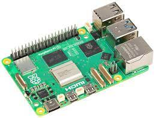
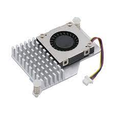

# Études et choix techniques

## Raspberry Pi

Une des problématiques du projet est de limiter les interactions avec l'extérieur et l'intérieur de la table, c'est-à-dire qu'il faut que la table soit besoin du minimum de périphériques rajoutés à son bon fonctionnement. Il est donc nécessaire que la table est ses propres outils pour fonctionner. La première étape est donc de choisir sur quel ordinateur nous allions utiliser pour faire tourner nos différentes applications. Nous avons alors choisi de partir sur une raspberry Pi 5 pour le coeur de notre système.Les motivations de ce choix sont la très petite taille de celle-ci ainsi que la facilité pour d'installation de Processing sur une raspberry. Nous pouvons ensuite brancher ce dont nous avions besoin tels qu'une souris, un clavier, un écran, des enceintes mais aussi notre projecteur et notre caméra pour détecter nos objets.

Pour aller avec notre raspberry Pi 5, il était nécessaire d'avoir un système de refroidissement adapter car étant donné qu'il y aura plusieurs logiciels actifs en même temps il pourrait y avoir une surchauffe et donc endommager la raspberry.

## Processing/Reactivision

