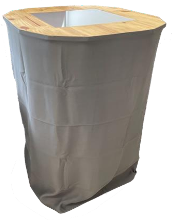

# Introduction

Bonjour à vous, nous sommes 3 étudiants d'Unilasalle Amiens en 3ème année en école d'ingénieur. Notre groupe est composé de Lucas Delsart, Noa Lecomte et de Baptiste Gogolewski. Durant cette année nous avons pour projet de réaliser une table interactive en utilisant le framework reacTIVision dont voici le site https://reactivision.sourceforge.net/

## Contexte du Projet

Comme énoncé plus tôt nous sommes en 3ème année et nous devons donc, pour la valider, présenté un projet regroupant les différentes notions que nous avons vues tout au long de notre cursus. On retrouve différents domaines tels que l'électronique, la programmation ou encore la modélisation 3D. Pour nous aider à la réalisation d'un projet, nous avons eu à notre disposition une liste de divers projets. Nous nous sommes alors orientés vers le projet de RéacTable. Ce projet consiste à utiliser des tags collés à des objets. Ces derniers peuvent être par la suite bougé sur une table construite pour l'occasion, pour créer une interaction avec l'utilisateur. Elle contient plusieurs éléments, le premier élément est une caméra pour pouvoir détecter les tags et le deuxième élément est un projecteur qui sert à afficher ce que l'on veut lors de la détection des tags. Cependant, nous ne sommes pas les premiers à travailler sur ce projet car nous prenons la suite d'un groupe de l'année précédente. Nos objectifs finaux se voient donc différent d'un nouveau projet puisque nous avons déjà une base sur laquelle s'appuyer. 

## Objectifs du Projet

Les objectifs de notre projet peuvent être séparés en deux catégories. La première regroupe la conception et le design. En effet, le projet précédent comporte plusieurs problèmes en ce qui concerne la mobilité et l'usage. Voici une image montrant la table construite l'année dernière : 

Pour ce qui est de la mobilité, il nous faut réaliser des modifications au niveau de la partie supérieure de la table puisque cela pose problème lors du passage dans certaines portes. Il faut également modifier la partie inférieure de la table car cette dernière manque de stabilité. Par ailleurs, l'ajout d'un système permettant à la table de bouger est aussi nécessaire. La dernière problématique à laquelle il faut répondre au niveau de la conception, c'est l'ajout d'un dispositif interne à la table pour permettre à n'importe quel utilisateur de faire fonctionner la table. La deuxième catégorie comporte les objectifs en lien avec l'électronique et la programmation. Tout d'abord, nous avons un objectif qui fait référence à la catégorie précédente puisque après avoir installé le dispositif, il faut le configurer. Enfin, la dernière étape est de créer une application qui permet à l'utilisateur d'interagir avec les objets posés sur la table. Pour préciser l'application, elle doit comporter un mode de découverte des fonctionnalités ainsi qu'un mode musical. 

## Cahier des Charges

Afin de mener à bien ce projet et d'être le plus efficace possible, il était impératif de nous répartir les tâches. Nous avons donc listé tous nos objectifs et avons créé un cahier des charges permettant à chacun de savoir ce qu'il devait faire tout au long du projet. 

| Tâches                                                                                              | Etudiants                    |  
|:---------------------------------------------------------------------------------------------------:|:----------------------------:|
| Refonte de la partie supérieur de la table                                                          | Baptiste Gogolewski          |
| Intégration d'un système de roulettes et de poignées                                                | Baptiste Gogolewski          |
| Esthétique de la table revu : Enlever le rideau et repeindre la table                               | Lucas Delsart et Noa Lecomte |
| Intégrer un PC de contrôle au sein de  la table                                                     | Baptiste Gogolewski          |
| Création d'une application éducative permettant de comprendre toutes les fonctionalités de la table | Lucas Delsart                |
| Création d'une application de musique avec des animations                                           | Noa Lecomte                  |

Maitenant que cela était fait, nous pouvions commencer à travailler ! 
