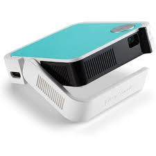
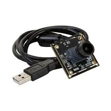
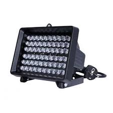
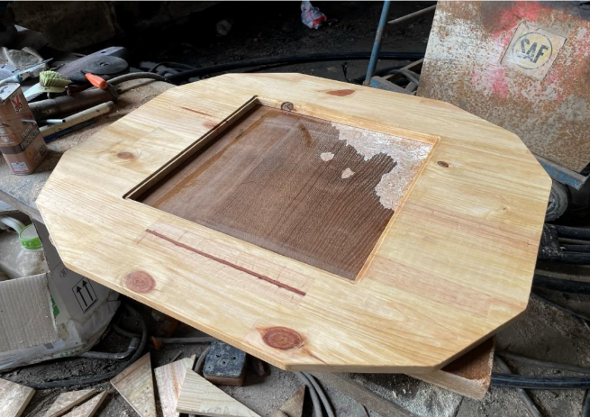
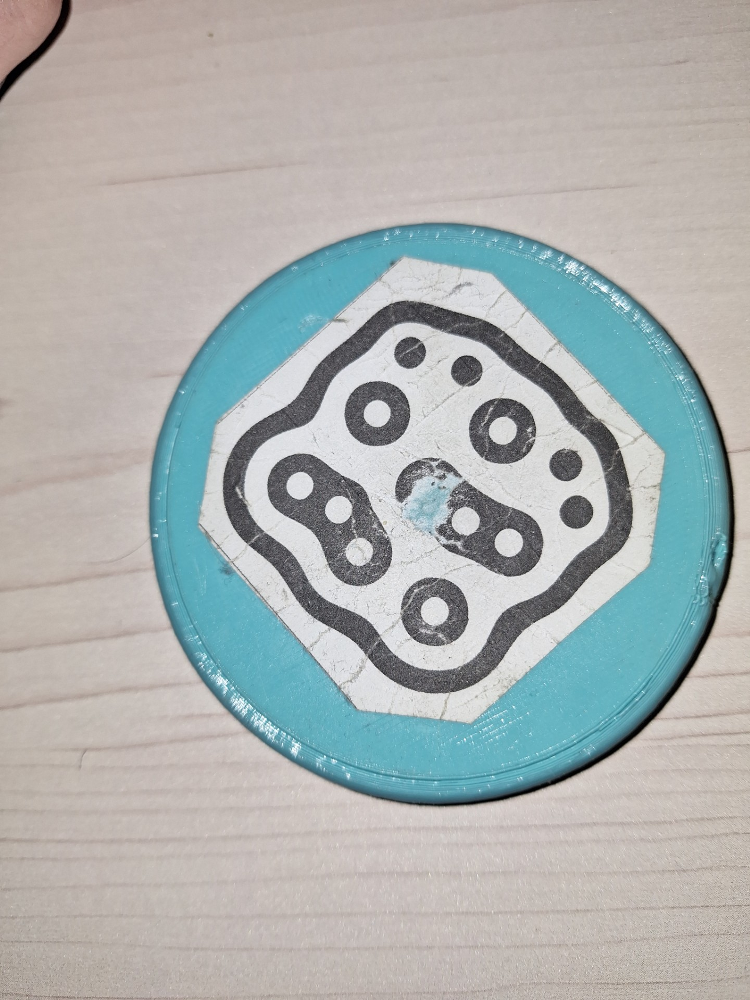

# Composants du précédent projet

Comme nous prenons la suite du projet de l'année dernière, nous pouvions reprendre les composants fonctionnels du groupe précédent ce qui nous permettra de gagner du temps sur la réalisation de nos objectifs. En ce qui concerne cette partie, nous n'avons rien modifié dans leur système puisque les choix nous paraissent cohérents.

## Projecteur

Le projecteur qui permet l'affichage de notre code est le projecteur Viewsonic Mini M1 de chez LDLC Pro. Ses avantages sont qu'il correspond aux contraintes de projection, c'est-à-dire qu'il peut afficher une image sur un carré de 40cm par 40cm à une distance de 1m. C'est aussi, comme son nom l'indique, un petit composant et donc prend peu de place.

## Caméra

La caméra choisie, est une caméra USB de chez GOTRONIC. De plus, une lentille infrarouge à grand angle a été rajoutée pour que la caméra distingue plus facilement la différence entre le blanc et le noir. Cette lentille règle aussi un problème lié à la lumière émise par le projecteur. Une fois la lentille positionnée sur la caméra, cette lumière, qui appartient au domaine du visible, n'est plus détectée.

## Projecteur infrarouge

Pour que la caméra avec lentille infrarouge fonctionne correctement, il faut un projecteur infrarouge. Ce projecteur devait répondre à plusieurs contraintes telles que la longueur d'onde de sa lumière, ici 850 nm. Ainsi que la puissance pour éviter des problèmes de détection.

# Supports et matériaux du projet précédent

Dans cette second partie, nous allons voir les éléments réalisés par le groupe précédent et notre décision sur la modification ou non de ces éléments pour répondre à nos problématiques.

## Planche supérieure

Notre décision pour la planche supérieure fut très vite prise lors de ce projet car elle faisait partie des problématiques de notre cahier des charges. En effet, cette planche est trop emcombrante, il faut donc la remplacer ou la réduire.

Cependant, nous avons mis pas mal de temps à trouver une solution. Dans un premier temps, nous avons pensé à redécouper la planche pour qu'elle est une dimension plus convenable. Mais plusieurs problèmes sont apparus, nous ne pouvions pas réaliser cette découpe dans l'école car il n'y avait pas d'outils pour un bois d'une telle épaisseur. Il fallait donc que nous la fissions directement chez nous, mais ne possédions ni les outils ni le moyen de transporter la planche pour mener à bien cette découpe.

Nous nous sommes alors dirigé vers la réfection complète de cette partie supérieure en gardant les contraintes liés à la taille de l'écran et au moyen de fixation. 

## Structure de la table

Au niveau de la structure de la table, nous avons décidé de ne rien changer sur son aspect fonctionnel. Nous avons gardé le châssis en profilé aluminium, ainsi que les planches fixées autour de ce dernier et la plaque de plexiglas qui sert d'écran pour le projecteur. Cependant, pour l'esthétisme de la table, nous avons décidé de peindre les planches.

## Supports

Pour fixer les différents composants cités précédemment, l'équipe de l'année dernière a créé plusieurs supports que ce soit pour le projecteur, la caméra ou le projeteur infrarouge. Ainsi que plusieurs petites pièces qui ont permis l'assemblage du châssis. Nous avons décidé de garder tous ces éléments tels qu'ils étaient car nous les trouvions efficaces dans leurs rôles.

## Objets pour les tags

Les objets initialement créés par le groupe précédent avaient été pensés pour convenir aux 2 modes de jeu qu'ils avaient créés. Pour certains de ces objets, leurs utilisations dans un autre domaine que leurs conceptions de base n'étaient pas pratiques pour ce que l'on voulait en faire. Par exemple, le tag ci-dessous, n'est pas agréable à prendre en main sur la table car trop grand et trop plat. De plus, le papier du tag étant usé l'objet devient inutilisable.

Nous avons tout de même gardé une manette de pong et le cube qu'il avait créé puisque cela pouvait nous être utile dans nos applications.

# Application

Le projet de nos prédecesseurs incluait un jeu de pong. Cependant, ce dernier, en plus de quelques petits bugs ressentis, ne permettait pas à l'utilisateur d'utiliser toutes les fonctionnalités des tags. Egalement, ce jeu fût développé avec Unity, un moteur de jeu très gourmand et nécessitant un bon ordinateur. Il se demandait alors "Pourquoi acheter une Interactiv'Table ?" quand il pouvait simplement y jouer sur un smartphone ou une tablette tactile. 
Il nous fallait donc trouver des idées montrant les différentes possibilités de la table afin de faire comprendre au public l'interet et l'utilité de cette table interactive. 
