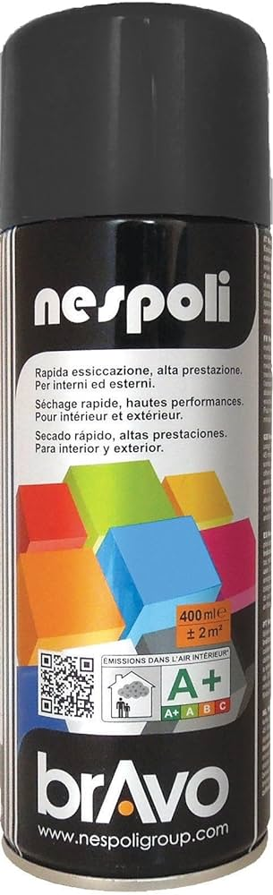

# Choix de la peinture

Pour améliorer l'esthétisme de notre projet, nous avons décidé de peindre les planches recouvrant la structure de la table. Comme le plateau allait être fabriqué en acrylique noir, nous avons choisi de nous diriger vers la couleur noire. Cependant, nous n'avions aucune idée de la quantité de peinture nécessaire. Nous hésitions entre un pot ou une bombe de peinture. On nous a alors conseillé de partir sur des bombes de peinture. Pour plus d'efficacité. C'est aussi pour ne pas gâcher de peinture que nous avons fait ce choix. Nous avons donc commandé 3 bombes de peinture de noir brillant.

