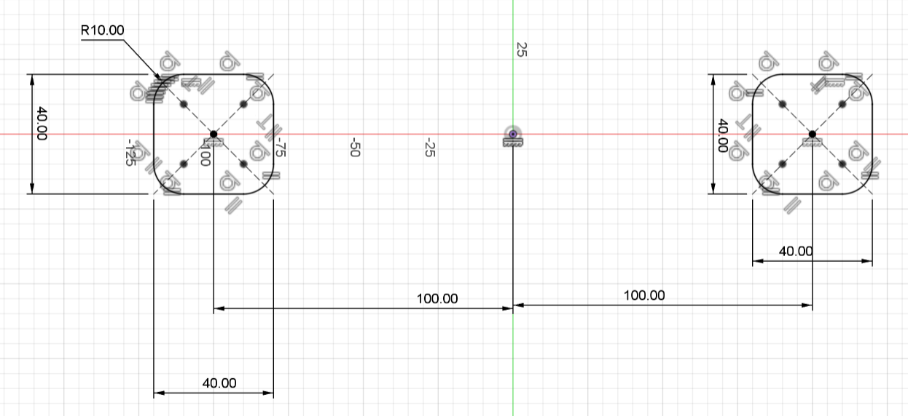
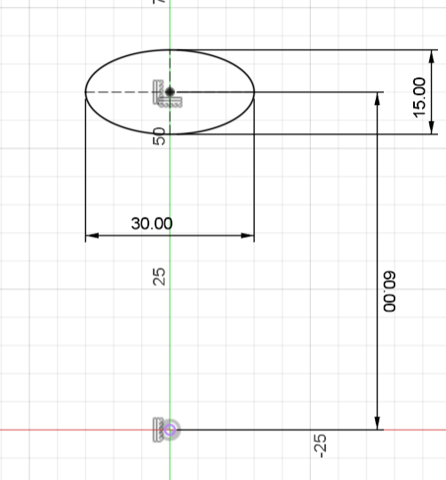
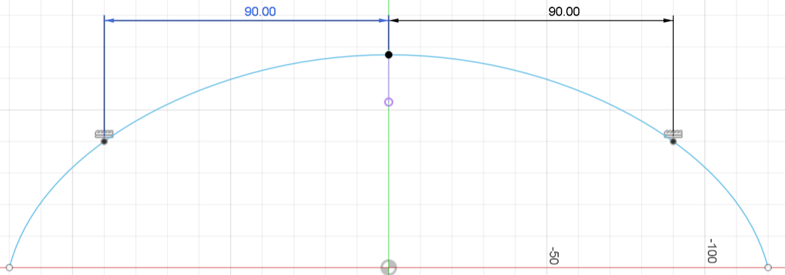
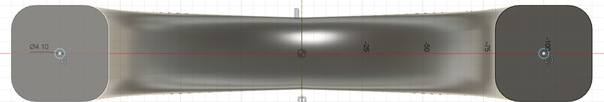
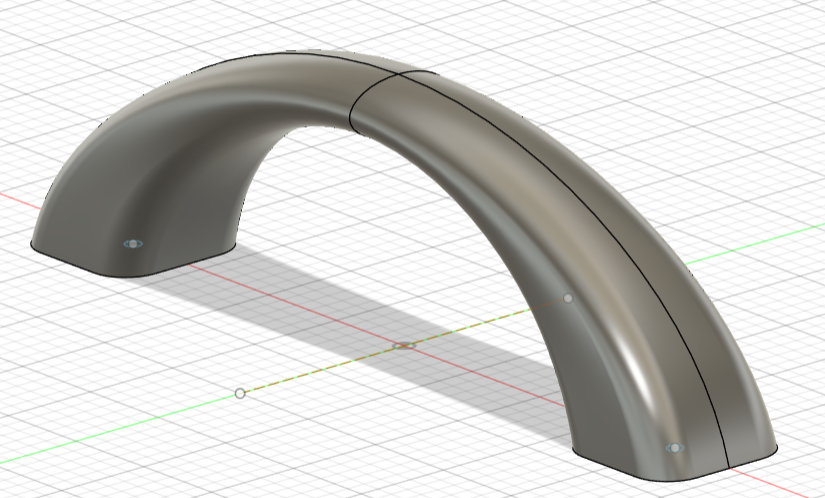

# Modélisation de la poignée

## Introduction

- Nom de la pièce : Poignée

- Description : Cette pièce est une poignée conçue pour offrir une prise en main confortable.

- Matériau : PLA

- Auteur : Baptiste Gogolewski

## Dimensions et Caractéristiques Techniques

### Vue d'ensemble de la poignée

- Dimensions principales :
    - Longueur totale: 200 mm
    - Diamètre de la base: 40 mm
    - Rayon du congé: 10 mm

    

- Section transversale:
    - Diamètre de l'ellipse: 30 mm x 50 mm
    - Distance entre le centre de l'ellipse et l'origine : 60 mm
    - Rayon de courbure : 90 mm

    

    

- Détails des trous pour inserts:
    - Diamètre du trou: Ø4.10 mm

    


## Détails Techniques

```Schéma 1: Vue de la base de la poignée```

- Description: Cette vue montre les dimensions de la base de la poignée.

```Schéma 2: Section transversale de la poignée```
- Description: Cette vue montre les dimensions de l'ellipse utilisée pour la section transversale de la poignée.

```Schéma 3: Section transversale de la poignée```
- Description: Cette vue montre le chemin utilisé pour créer la forme de la poignée par balayage.

```Schéma 4: Détails des inserts filetés```
- Description: Cette vue montre la position et le diamètre des trous pour les inserts filetés de la poignée.

```Objet finale```



Pour modéliser cette poignée, j'ai choisi de mettre en place une nouvelle technique pour former, grâce à l'ellipse (ellipse) et à la base (base poignée), un objet 3D de la forme des ellipses suivant un axe de courbure (chemin poignée). J'ai utilisé un balayage.

## Instructions de Montage
- Étape 1 : Vérifiez que toutes les dimensions correspondent aux spécifications fournies.
- Étape 2: Insérez les inserts filetés dans les trous prévus à cet effet à la base de la poignée.
- Étape 3: Montez la poignée sur la table.

## Matériaux et Procédé de Fabrication

- Matériau : PLA
- Procédé de fabrication : impression 3D