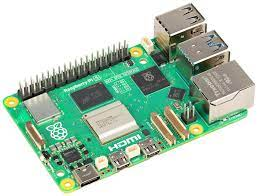
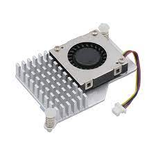

# Choix du PC
Une des problématiques du projet est de limiter les interactions avec l'extérieur et l'intérieur de la table, c'est-à-dire qu'il faut que la table soit besoin du minimum de périphériques rajoutés à son bon fonctionnement. Il est donc nécessaire que la table est ses propres outils pour fonctionner. La première étape est donc de choisir sur quel ordinateur nous allions utiliser pour faire tourner nos différentes applications. Plusieurs alternatives nous ont alors été suggérées. 

On y retrouve: 
- un Mini PC
- un Raspberry Pi 5

## Raspberry Pi
Nous avons choisi de partir sur un raspberry Pi 5 pour le coeur de notre système. 
Les motivations de ce choix sont:
- sa petite taille, ce qui nous permettra de ne pas être encombré à l'intérieur de la table,
- son prix, plus abordable que le mini pc, de plus l'école pouvait nous en fournir une,
- la facilité d'installation de Processing et de réactivision sur un raspberry, on peut trouver toutes les versions des logiciels pour le raspberry sur leurs sites. 

Nous pourrons ensuite brancher ce dont nous avons besoin tels qu'une souris, un clavier, des enceintes mais aussi notre projecteur et notre caméra pour détecter nos objets.

Pour aller avec notre raspberry Pi 5, il est nécessaire d'avoir un système de refroidissement adapter car étant donné qu'il y aura plusieurs logiciels actifs en même temps il pourrait y avoir une surchauffe et donc cela pourrait endommager le raspberry.

