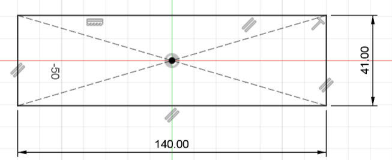
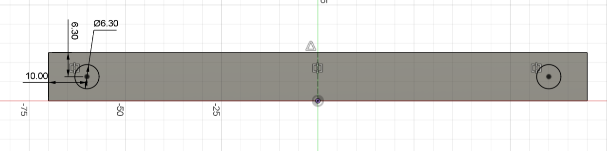
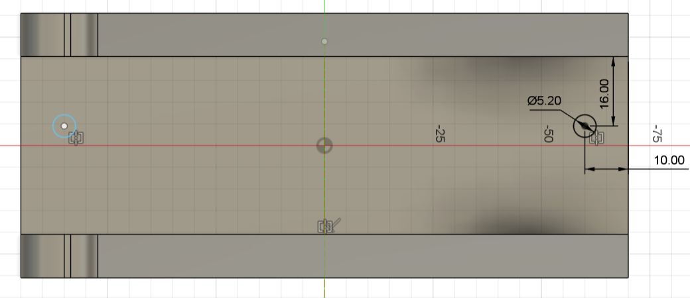
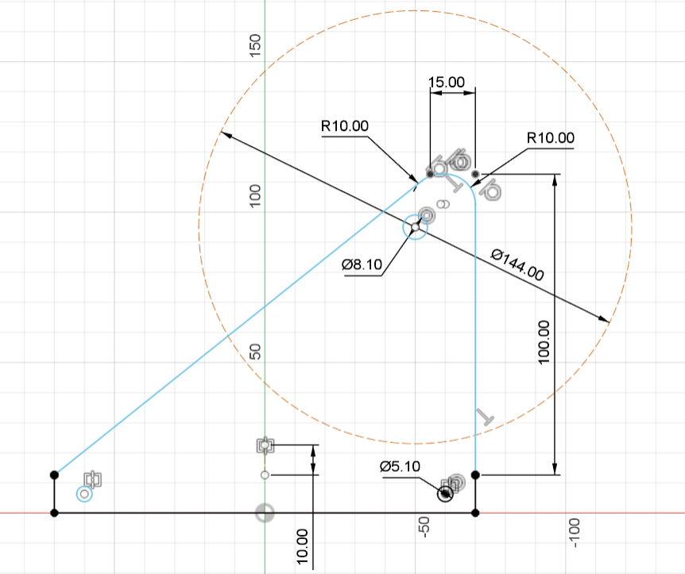
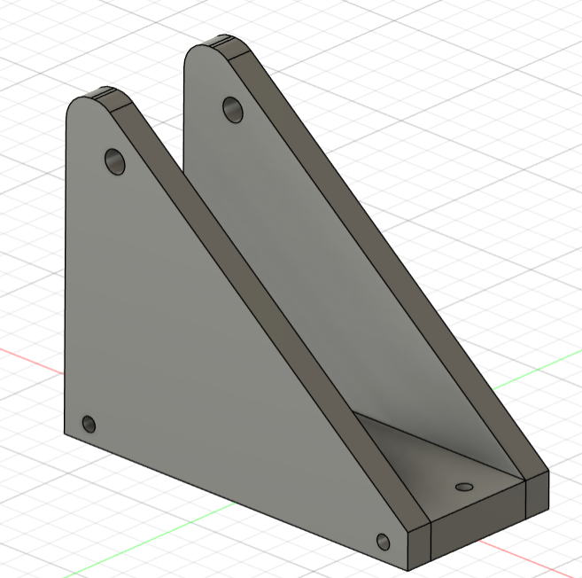
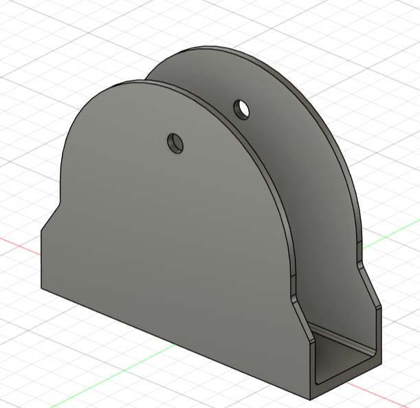

# Modélisation du support pour la roue

## Introduction

- Nom de la pièce : Support pour roue de 144 mm

- Description : Ce support est conçu pour accueillir une roue 
de 144 mm. Il se compose d'un socle fixé sur un profilé en aluminium et de côtés en bois (basswood) de 5 mm * 2 d'épaisseur. Les côtés sont vissés au socle avec des inserts filetés M5. Le socle dispose de deux trous pour le fixer au profilé en aluminium, et les côtés ont un trou pour accueillir une tige filetée de 8 mm qui passera à travers la roue.

- Matériaux :
    - Socle : PLA
    - Cotés : Basswood de 5 mm d'épaisseur

- Auteur : Baptiste Gogolewski

## Dimensions et Caractéristiques Techniques

### Vue d'ensemble du socle

- Dimensions principales du socle :
    - Longueur : 140 mm
    - Largeur : 41 mm
    - Hauteur : 12.6 mm

    

- Détails des trous du socle :
    - Trous pour fixation au profilé: Ø5.20 mm
    - Trous pour inserts filetés: Ø6.30 mm, profondeur 12.3 mm


    
    

### Vue d'ensemble des côtés

- Dimensions principales des côtés :
    - Hauteur : 112.6 mm
    - Largeur : 140 mm
    - Epaisseur: 5 mm (chaque côté, deux fois 5 mm)

    

    Le cercle qui est déssiné en trait de construction représente le diamètre de la roue de 144 mm.


## Détails Techniques

```Schéma 1 : Vue du socle avec cotes```

- Description : Cette vue montre les dimensions principales du socle ainsi que les positions des trous pour les inserts filetés et la fixation au profilé en aluminium. (dimension socle, troue socle et troue socle profilé)

```Schéma 2 : Vue des côtés avec cotes```

- Description : Cette vue montre les dimensions principales des côtés ainsi que les positions des trous pour la tige filetée et la fixation au socle. (dimension coté)

```Objet finale```

- 

Ce support est une version 2. La première version était plus fragile cause des cotées (3 mm d'épaisseur). J'ai donc repris la base de la première version et modifié les cotés pour obtenir la version finale.

Voci une image de la première version :

- 

## Instructions de Montage

- Étape 1 : insérer les inserts filetés M5 dans les trous prévus du socle.
- Étape 2 : Fixer les côtés en basswood au socle en utilisant des vis M5, en alignant les trous.
- Étape 3: Fixer le socle au profilé en aluminium à l'aide des trous de Ø5.20 mm et des vis appropriées.
- Étape 4: Insérer la tige filetée de 8 mm à travers les trous des côtés et de la roue.
- Etape 5 : Visser les ecrous pour que la roue et la tige filetée ne bougent pas.

## Matériaux et Procédé de Fabrication

- Matériau :
    - Socle: PLA
    - Côtés: Basswood

- Procédé de fabrication : impression 3D pour le socle et découpeuse laser pour les cotés.