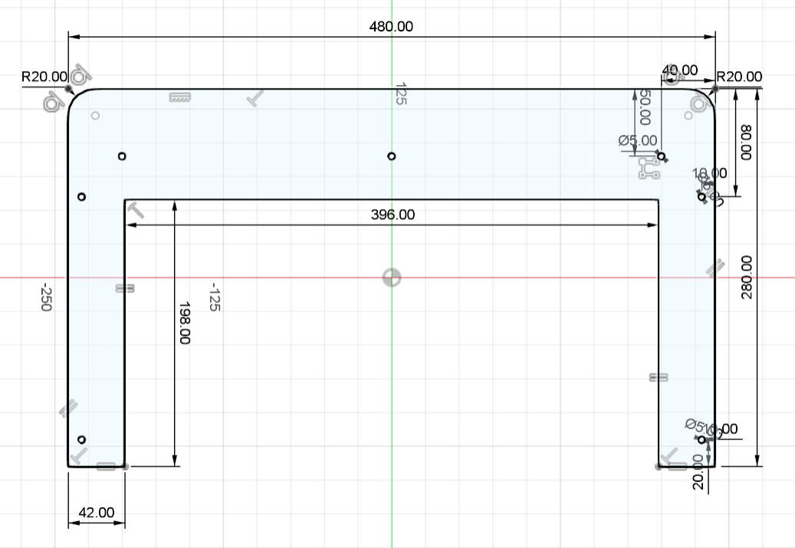
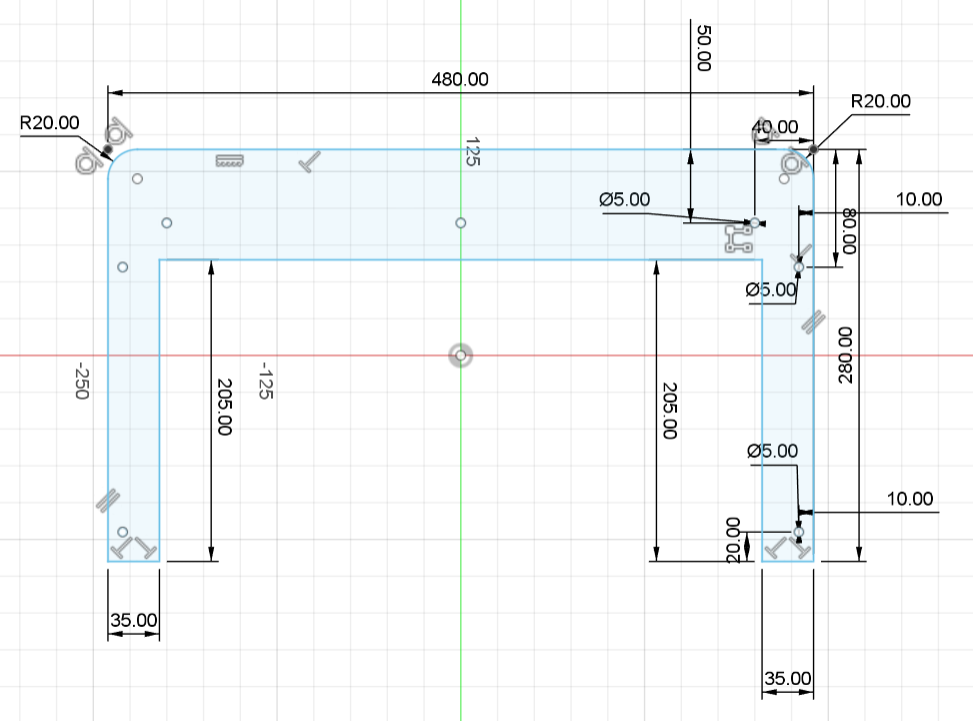
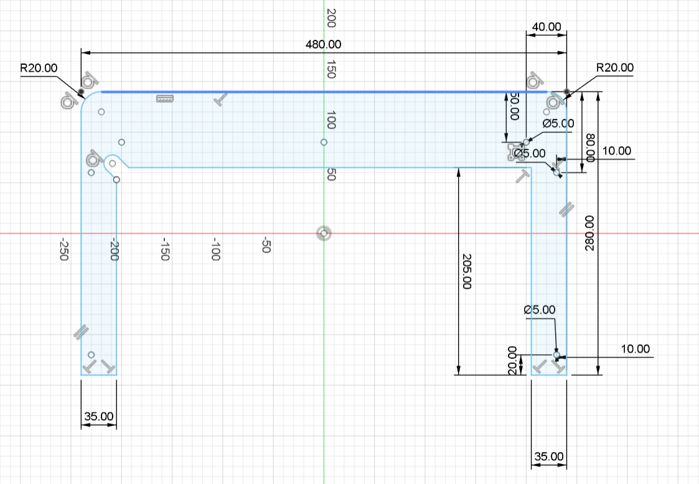
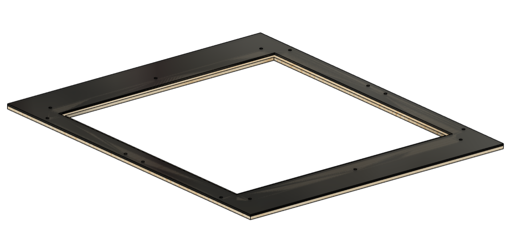
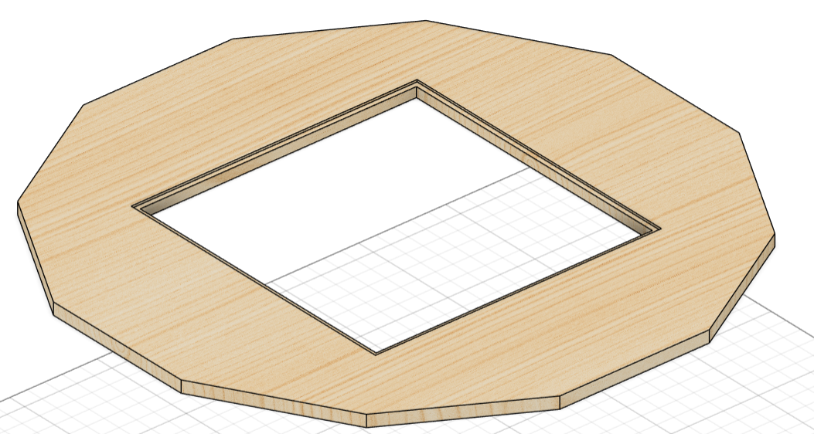

# Modélisation du plateau supérieur

## Introduction

- Nom de la pièce : Plateau supérieur

- Description : Ce plateau est plus petit que l'ancien. Il est fabriqué en basswood de 5 mm pour le premier étage et en acrylique noir de 3 mm pour le deuxième étage.

- Matériau : Basswood (5 mm) et acrylique noir (3 mm)

- Auteur: Baptiste Gogolewski

## Dimensions et Caractéristiques Techniques

### Vue d'ensemble du plateau supérieur

- Dimensions principales :
    - Longueur totale : 480 mm
    - Largeur totale : 280 mm
    - Rayon du congé des coins : 20 mm
    - Trous de Ø5 mm pour la fixation
    
    Plateau supérieur :
    

    Plateau supérieur 2 :
    

    Plateau supérieur 2 enlevable :
    


## Détails Techniques

```Schéma 1: Vue du plateau supérieur en basswood```

- Description : Cette vue montre les dimensions principales et les trous de fixation du plateau supérieur en basswood de 5 mm.

```Schéma 2: Vue du plateau supérieur en acrylique```

- Description : Cette vue montre les dimensions principales et les trous de fixation du plateau supérieur en acrylique noir de 3 mm.

```Objet finale```



Le plateau est donc divisé en 2 étages. Le premier étage (plateau supérieur) est en basswood de 5 mm. Le plateau supérieur qui va au dessus du basswood est en acrylique noir de 3 mm. Il y a un offset de 7 mm pour mettre une plaque sert d'écran. Des congés de 20 mm ont été réaliser pour plus d'esthétique.

Voici une image du plateau d'origine :


## Instructions de Montage

- Étape 1 : Vérifiez que toutes les dimensions correspondent aux spécifications fournies.
- Étape 2 : Placez le plateau en basswood de 5 mm sur la structure de support ainsi que celui de 3 mm en acrylique.
- Étape 3 : Fixez le plateau en utilisant les trous de Ø5 mm avec les vis appropriées.

## Matériaux et Procédé de Fabrication

- Matériau :
    - Basswood
    - Acrylique noir
- Procédé de fabrication : Découpeuse laser