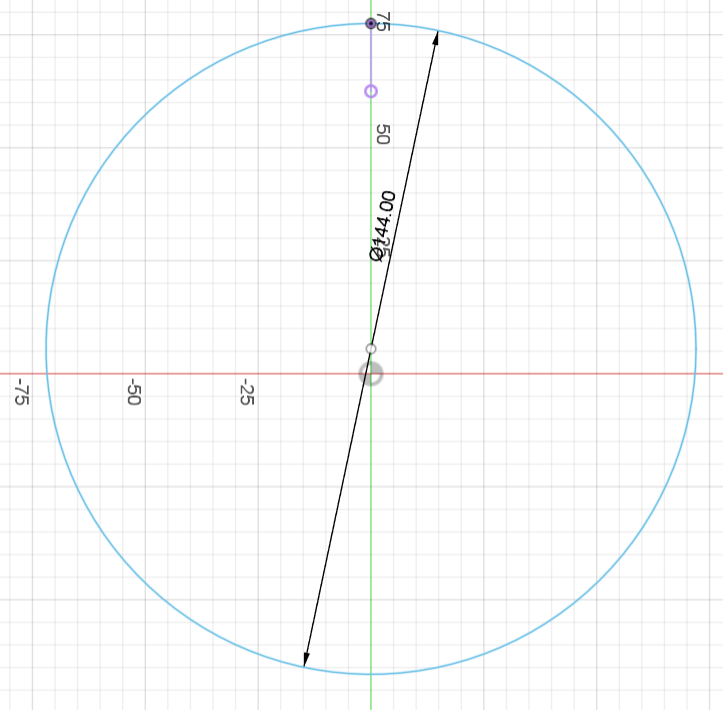
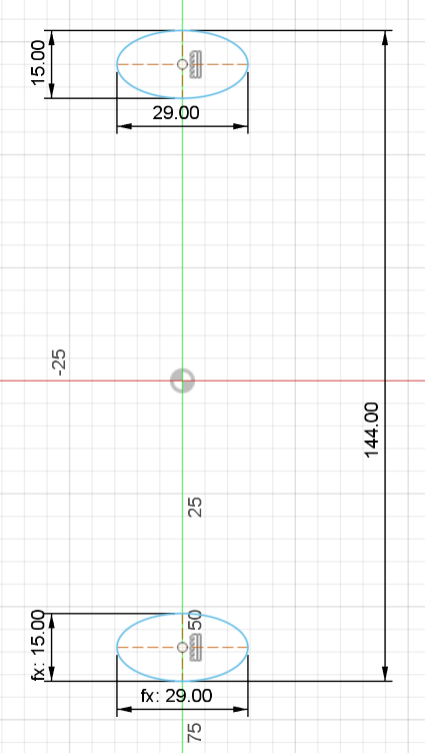
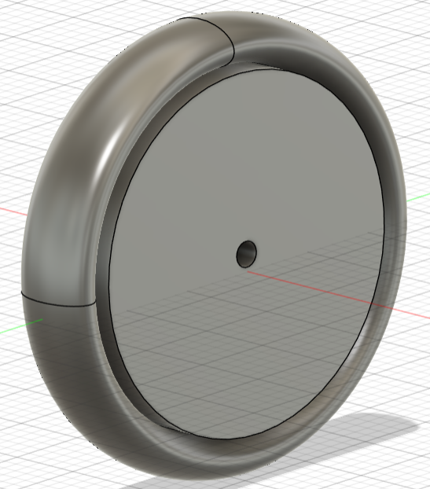

# Modélisation de la roue de 144 mm

## Introduction

- Nom de la pièce : Roue de 144 mm
- Description : Cette pièce est une roue de 144 mm de diamètre conçue pour intégrer un support modélisé en 3D.
- Date de création : mai 2024
- Auteur : Baptiste Gogolewski

## Dimensions et Caractéristiques Techniques

### Vue d'ensemble

- Diamètre de la roue: 144 mm

    

- Vue de la face avec les cotes principales
    - Dimensions du cercle extérieur: 144 mm de diamètre
    - Distance entre les deux ellipses: 144 mm
    - Dimensions des ellipses: 29 mm x 15 mm

    

- Vue de coupe

    

## Détails techniques

```Schéma 1: Vue de face avec diamètre```

- Description : Cette vue montre le cercle extérieur de la roue avec un diamètre de 144 mm.

```Schéma 2: Vue latérale avec cotes```

- Description : Cette vue montre les cotes principales de la roue, y compris les dimensions des ellipses et la distance entre elles.

```Schéma 3: Vue en coupe```

- Description : Cette vue montre la roue avec son centre qui n'est pas encore rempli.

```Objet finale```

- 

Pour modéliser cette roue, j'ai choisi de mettre en place une nouvelle technique pour former, grâce aux deux ellipses (premier schema) et au diamètre (deuxieme schema), un objet 3D de la forme des ellipses suivant le diamètre. J'ai utilisé un balayage.